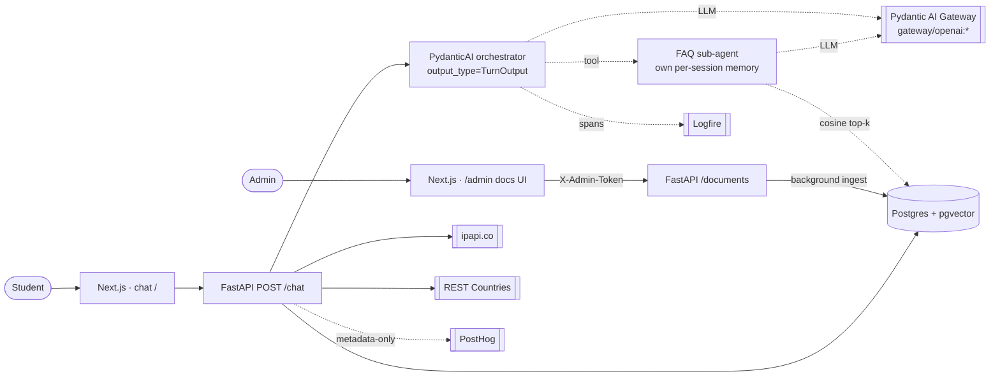
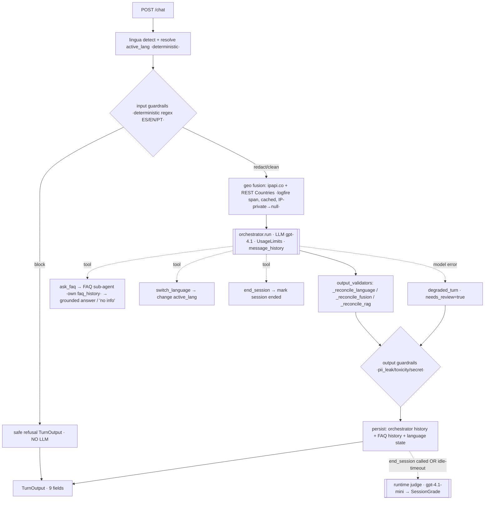

# Architecture — Zapp Philosophy School Agent

Quick-reference map of the running system: topology, the per-turn pipeline, every LLM call, and the
key design decisions (incl. what we tried and reverted). Built Spec-Driven (`specs/`).

## 1. Topology

One token (`PYDANTIC_AI_GATEWAY_API_KEY`) powers chat **and** embeddings via the gateway. Local dev =
`docker compose up` (pgvector image + FastAPI + frontend).

## 2. Per-turn `/chat` pipeline

Tools-first: **`switch_language`** (fixes language change — no more "can't switch"), **`end_session`**
(triggers the end-of-conversation eval — replaced the old `is_goodbye` keyword heuristic), **`ask_faq`**
(FAQ sub-agent with its OWN per-session memory, so the orchestrator stays lean). Guardrail block
short-circuits before any LLM call.

## 3. LLM / external-call inventory

| Call | When | Model / API |
|---|---|---|
| Orchestrator | every non-blocked turn | `gateway/openai:gpt-4.1` (UsageLimits, retries) |
| FAQ sub-agent | when `ask_faq` is called | worker model; own `faq_history_json`; `usage` forwarded |
| Offline + runtime judge | CI eval / `end_session`+idle | `gateway/openai:gpt-4.1-mini`, structured int 1-5, temp 0 |
| Embeddings (FAQ-RAG) | ingest + query | OpenAI `text-embedding-3-small` via gateway (1536-dim) |
| Geo-IP + locale | every turn (cached/IP) | ipapi.co + REST Countries (non-LLM) |

Deterministic / zero-LLM: lingua detection, **guardrail detectors** (regex/wordlists ES/EN/PT), geo
reconciliation, RAG cosine retrieval.

## 4. Per-turn contract (9 fields)
`reply · detected_lang · active_lang · lang_confidence · final_normalized_text · detected_country ·
confidence_score · needs_review · guardrails{input,output}`

| Field(s) | Owner spec |
|---|---|
| detected_lang / active_lang / lang_confidence | `multilingual` (switch via `switch_language` tool) |
| guardrails.{input,output} | `guardrails` (deterministic, at boundary) |
| detected_country / final_normalized_text / confidence_score | `orchestrator-and-fusion` |
| reply / needs_review | shared; geo damps confidence only |

## 5. Key decisions (incl. reverted)

- **Guardrails = deterministic regex/wordlists at the boundary** (ES/EN/PT). We TRIED
  `pydantic-ai-guardrails` `GuardedAgent` but reverted: the built-in detectors are English-centric, it
  needed as much custom code, and it regressed recall/task_success/judge for the trilingual platform.
- **Evals = custom** (structured-int judge + `TaskSuccess`/`LanguageFidelity`/`GuardrailHit` evaluators
  + `run.py` gate). We TRIED `pydantic_evals` `LLMJudge`/`OnlineEvaluation` but reverted (broke the
  metrics). The real-LLM gate is inherently noisy → **variance-tolerant thresholds** (task_success ≥0.80,
  judge_mean ≥3.5, latency_p95 ≤30s; guardrail recall/precision ≥0.95/0.90; language_fidelity ≥0.98).
- **Tools-first** orchestrator: `ask_faq` / `switch_language` / `end_session`. Sub-agents keep their own
  memory. **Gateway-only** LLM + embeddings (one token). **pgvector-only** RAG (HNSW cosine; PageIndex
  deferred). **ADK rejected** (PydanticAI only).
- Code: OOP-where-state (service classes), naive-UTC via `app/time.now_utc`, ruff complexity gate
  (C901≤12 / PLR), concise docstrings.

## 6. Status (specs → code)

✅ platform-scaffold · multilingual (+ switch_language tool) · guardrails (deterministic) · evaluation
(custom + end_session tool) · orchestrator-and-fusion · faq-rag (pgvector RAG + admin UI + sub-agent
memory). ⏳ events (enroll → `.ics`) · platform-deploy (Railway + Vercel).

Tests: `uv run pytest` (374). Eval: `uv run python -m evals.run` (variance-tolerant gate). Local:
`docker compose up --build`.
