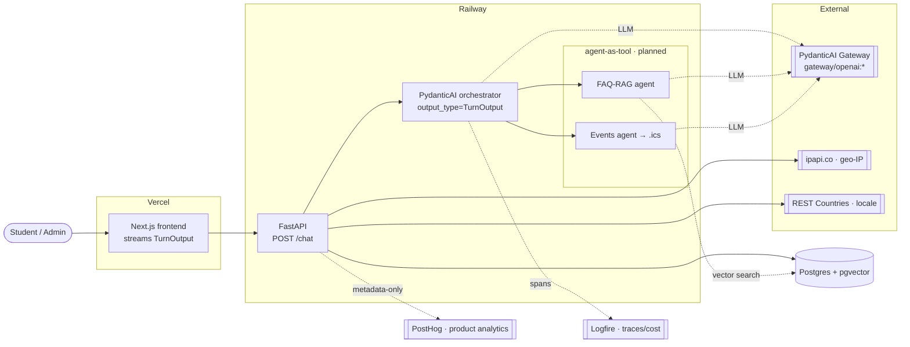
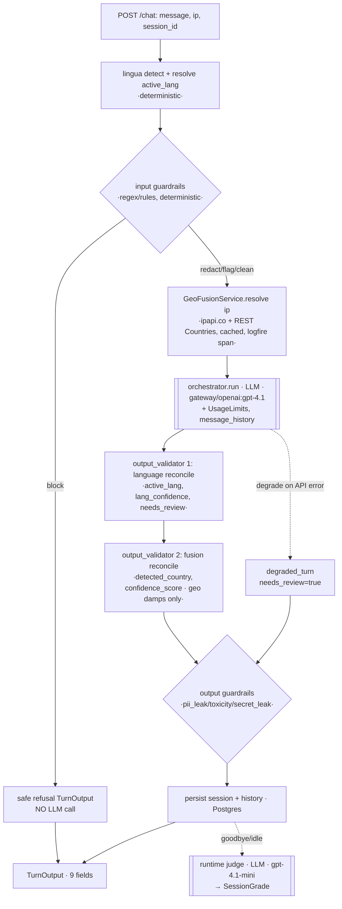

# Architecture — Zapp Philosophy School Agent

Quick-reference map of the running system: topology, the per-turn pipeline, and **every LLM call**.
Built Spec-Driven (see `specs/`); this doc is the "what do we have" overview, kept in sync as features land.

## 1. System topology



LLM access is **gateway-only** (one key `PYDANTIC_AI_GATEWAY_API_KEY`, model strings
`gateway/<provider>:<model>`). FAQ-RAG + Events agents are specced but not yet built.

## 2. Per-turn `/chat` pipeline

Deterministic steps in black, the **one LLM call** and external APIs marked. Order matters.



Key rule: a **guardrail block short-circuits before any LLM call** (cheap, key-free). Geo runs
**after** guardrails, **before** the model. `needs_review` is set only by the **language + guardrail**
layers — **geo never forces review** (it only damps `confidence_score`).

## 3. LLM call inventory (every gateway call)

| Call | When | Model | Notes |
|---|---|---|---|
| **Orchestrator** | every non-blocked turn | `gateway/openai:gpt-4.1` | produces `TurnOutput`; capped by `UsageLimits`; `+retries` |
| Optional guardrail classifier | per turn **iff** `guardrails_llm_enabled` (default **off**) | worker model | augments deterministic guardrails; never weakens a block |
| FAQ-RAG / Events sub-agents | when those features land (agent-as-tool) | worker model | forward `deps`+`usage` to the orchestrator's `RunUsage` |
| **Offline eval judge** | `uv run python -m evals.run` (CI) per Case | `gateway/openai:gpt-4.1-mini` | structured int 1–5, temp 0 |
| **Runtime judge** | on goodbye intent or idle-timeout sweep | `gateway/openai:gpt-4.1-mini` | grades transcript → `SessionGrade`; Logfire+PostHog(metadata) |

**Not LLM** (deterministic, zero token cost): lingua language detection, all input/output guardrail
detectors (regex/wordlists), geo fusion + reconciliation, the per-IP geo cache.

**Non-LLM external APIs:** ipapi.co (geo-IP) + REST Countries (locale) — per turn, cached per IP,
inside one `logfire.span("geo_fusion")`; both go through the instrumented `httpx` client.

## 4. The per-turn contract (canonical, 9 fields)

```json
{ "reply": "...", "detected_lang": "es", "active_lang": "es", "lang_confidence": 0.97,
  "final_normalized_text": "...", "detected_country": "MX", "confidence_score": 0.0,
  "needs_review": false, "guardrails": { "input": [], "output": [] } }
```

## 5. Which feature owns which contract field

| Field | Owner spec |
|---|---|
| `reply` | orchestrator (all features write through it) |
| `detected_lang`, `active_lang`, `lang_confidence` | `multilingual` |
| `guardrails.{input,output}` | `guardrails` |
| `detected_country`, `final_normalized_text`, `confidence_score` | `orchestrator-and-fusion` |
| `needs_review` | shared — set by `multilingual` (lang) + `guardrails`; **geo damps `confidence_score` only** |

## 6. Observability & data

- **Logfire** — one distributed trace per turn (orchestrator + tool + httpx spans), token cost via
  genai-prices; PII-scrubbed; feeds eval p50/p95 + cost-per-conversation.
- **PostHog** — product analytics, **metadata-only** for student messages (names/scores/flags, never content).
- **Postgres + pgvector** — `ConversationSession` (+history), `SessionGrade`; pgvector reserved for FAQ-RAG.

## 7. Status (specs → code)

- ✅ `platform-scaffold`, `multilingual`, `evaluation`, `guardrails`, `orchestrator-and-fusion`
- ⏳ `faq-rag` (pgvector RAG), `events` (enroll → `.ics`), `platform-deploy` (Railway + Vercel)

Local: `docker compose up` (pgvector + FastAPI + frontend). LLM path: gateway-only. Tests: `uv run pytest`.
Eval gate: `uv run python -m evals.run` (CI-gated, exits non-zero on threshold breach).
