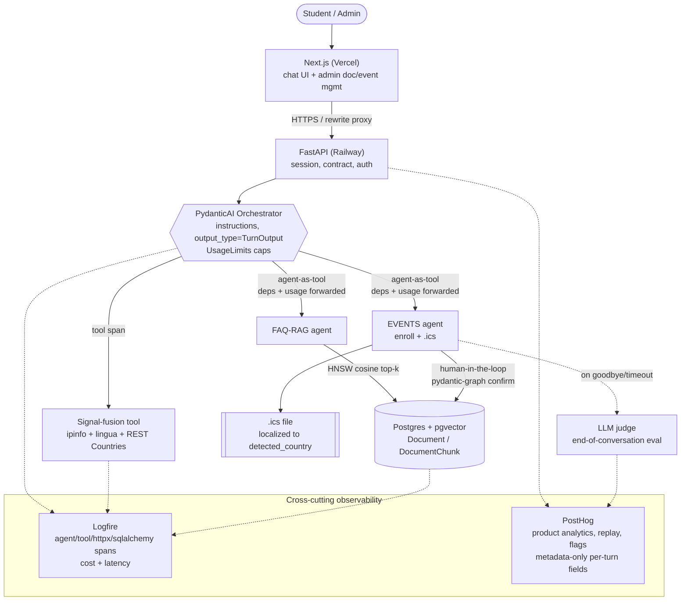

# Zapp Global — Philosophy School Conversational Platform

## 1. Vision

The Philosophy School platform is a multilingual conversational agent that helps prospective and
current students of a philosophy school get instant answers and enroll in events. A visitor opens a
chat (anonymous, with a `session_id`), writes in **ES, EN, or PT**, and a PydanticAI **orchestrator**
routes each turn — *agent-as-tool* — to either a **FAQ-RAG agent** that answers from the school's
uploaded documents, or an **EVENTS agent** that enrolls the user and returns a downloadable `.ics`
calendar file with event times localized to the student's detected country. Every turn is hardened by
measurable guardrails (PII / injection / toxicity) and enriched by signal fusion (geo-IP + deterministic
language detection reconciled with the LLM). On `goodbye`/timeout the conversation is scored by an LLM
judge. Admins manage documents and events through the platform; engineers watch cost, latency, and
quality through Logfire + PostHog. The whole thing is built **Spec-Driven**: specs are committed before
code, and git history shows specify → design → plan-tasks → implement → verify.

## 2. Feature breakdown by tier

We **implement Tier 3 (the full vision)**. Risky / costly features ship behind config flags so the
graded minimum is always green; if a flag's feature regresses, we flip it off and degrade gracefully.

### Tier 1 — graded minimum (must always pass)
- **Multilingual orchestrator**: PydanticAI orchestrator with ES/EN/PT detection, `active_lang` lock,
  and graceful fallback for unsupported languages (`needs_review=true`).
- **Guardrails**: input + output PII / prompt-injection / toxicity via `pydantic-ai-guardrails`,
  triggered names surfaced in the contract.
- **One API fusion**: geo-IP (ipinfo.io) + `lingua` detector fused with the LLM's `detected_lang`,
  reconciled in an output validator into `confidence_score` / `needs_review`.
- **Offline eval suite**: `pydantic-evals` dataset of Cases (1:1 to acceptance criteria) with a
  CI exit-code gate and p50/p95 latency.
- **Deploy**: backend + Postgres(pgvector) on Railway, Next.js on Vercel, reachable end-to-end.

### Tier 2 — core product
- **FAQ-RAG over pgvector**: SQLModel `Document` / `DocumentChunk`, HNSW cosine top-k retrieval over
  uploaded docs; low/empty retrieval lowers `confidence_score` and sets `needs_review`.
- **Events / enroll / .ics**: EVENTS agent collects email at enroll time, enrollment is gated behind a
  human-in-the-loop confirmation (`pydantic-graph`), returns an `.ics` localized to `detected_country`.
- **Runtime end-of-conversation eval**: on `goodbye`/timeout, an LLM-judge run scores the whole session;
  scores feed PostHog.

### Tier 3 — full vision (what we build)
- **Document & event management UI**: upload → background ingestion job → list → delete; update =
  re-ingest into new rows then atomic swap; admin-token protected.
- **PostHog dashboards**: product analytics over per-turn contract fields + runtime eval scores;
  session replay; feature flags.
- **Observability bonus**: Logfire tracing of every agent/tool/httpx span with cost + latency.
- **CI deploy gate**: eval thresholds block deploy; preDeploy migrations.

## 3. Resolved tech decisions

| Decision | Choice | One-line rationale |
|---|---|---|
| Scope | Tier 3, risky parts behind flags | Maximize rubric coverage without risking the minimum. |
| Agent framework | PydanticAI **only** (+ pydantic-ai-guardrails v0.2.x) | Typed deps/output + measurable guardrails in one runtime. |
| Google ADK | **Rejected** (documented open-decision) | ADK and PydanticAI are competing runtimes; don't compose in-process (only A2A as separate HTTP services). |
| RAG | pgvector-only (Postgres + pgvector, HNSW), hybrid-ready | One datastore, cosine top-k, no extra infra. |
| PageIndex | Documented **upgrade path**, not built | Defer reasoning-RAG until retrieval quality demands it. |
| Signal fusion | geo-IP (ipinfo.io/ipapi.co) + `lingua` + LLM, REST Countries enrich | Cross-check signals → `lang_confidence` agreement + locale. |
| Fusion placement | Inside a PydanticAI tool (Logfire span); reconcile in output_validator | Traceable, deterministic reconciliation. |
| Orchestration | agent-as-tool, sub-agents re-run with `deps=ctx.deps` + `usage=ctx.usage` | Shared deps + one aggregated `RunUsage` for cost/limits. |
| Usage caps | `UsageLimits(request_limit=8, tool_calls_limit=10, total_tokens_limit=20000)` | Bound runaway loops and cost per conversation. |
| pydantic-graph | **Only** for the human-in-the-loop enroll confirmation | Graph where it pays for itself; agent-as-tool elsewhere. |
| Auth | admin-token for doc/event mgmt; anonymous chat + `session_id`; email at enroll | Low friction for visitors, protected admin surface. |
| Prompting | `instructions=` over `system_prompt=` | system_prompt leaks persona into downstream agent history. |
| LLM judge | Pinned model id, temp 0, distinct provider/tier from prod; cheaper in CI; one config | Reduce self-preference bias; reproducible scoring. |
| Harness packaging | Plain project `.claude/` (not a plugin) | Plugin agents lose hooks / mcpServers / permissionMode. |
| Observability split | Logfire = backend + LLM tracing/cost/latency; PostHog = product analytics/replay/flags | Right tool per concern; Logfire scrubs PII, PostHog gets metadata-only. |
| Deploy | Railway (api + Postgres pgvector template); Vercel (root=frontend) | Matches stack foot-guns; reproducible IaC. |

## 4. The per-turn JSON contract

Every turn emits this object (verbatim, non-negotiable):

```json
{
  "reply": "string",                  // user-facing answer
  "detected_lang": "es",              // ISO 639-1 the user wrote in
  "active_lang": "es",                // language the session is locked to
  "lang_confidence": 0.97,            // agreement score LLM vs detector
  "final_normalized_text": "string",  // LLM + API fused, locale-normalized
  "detected_country": "MX",           // fused geo signal (ISO 3166-1 alpha-2)
  "confidence_score": 0.0,            // combined logic
  "needs_review": false,              // true on low confidence / divergence / errors
  "guardrails": { "input": [], "output": [] }  // triggered guardrail names
}
```

**Supported languages: ES, EN, PT.** Unsupported language → set `active_lang` to the configured
fallback AND `needs_review=true`, degrade gracefully.

## 5. Architecture



## 6. Rubric → feature traceability

| Graded criterion | Pts | Earned by (spec / feature) |
|---|---|---|
| SDD discipline | 20 | `specs/*/{requirements,design,tasks}.md`, EARS + Case ids, `require-spec` pre-commit hook (specs-before-code, enforced once registered — see `.claude/hooks/README.md`; repo-level gate blocking backend/frontend code commits until a committed spec trio exists in HEAD, not strict per-feature), git history specify→verify. |
| Guardrails | 20 | `pydantic-ai-guardrails` input/output (PII/injection/toxicity), native Hooks gating the destructive enroll, `guardrails` contract field. |
| LLM reasoning & prompting | 20 | Orchestrator `instructions=`, agent-as-tool routing, `output_validator` cross-field rules, `ModelRetry` self-correction, FallbackModel. |
| Evaluation system | 15 | Offline `pydantic-evals` suite + CI exit gate + p50/p95; runtime end-of-conversation LLM judge (pinned, temp 0). |
| Multilingual | 10 | ES/EN/PT detection, `active_lang` lock, unsupported→fallback+`needs_review`, locale (pt-BR/pt-PT, es-ES/es-MX). |
| API Integration & Signal Fusion | 10 | Fusion tool: ipinfo geo-IP + `lingua` + LLM `detected_lang` → `lang_confidence`; REST Countries enrich; reconcile in output_validator. |
| Code quality | 5 | Typed deps/outputs, SQLModel/Alembic, no globals, config in one module, structured contract. |
| Bonus: Workflow-orchestration / Observability | +10 | Logfire instrument_* spans + genai-prices cost; PostHog dashboards/replay/flags; CI deploy gate. |

## 7. Deploy topology & env matrix

**Topology.** Railway: `api` service (FastAPI, `uv run uvicorn app.main:app --host 0.0.0.0 --port $PORT`,
`preDeployCommand = uv run alembic upgrade head`, config at `backend/railway.toml` referenced explicitly)
+ **Postgres provisioned from the pgvector template/image** (plain Railway Postgres cannot enable
`vector`). Vercel: **Root Directory = `frontend/`**, `/api/*` proxied via Next.js rewrites (or CORS with
`allow_origin_regex r'https://.*\.vercel\.app'` for preview URLs). Pick **one region (US or EU)
consistently** across Logfire + PostHog.

| Env var | Where | Secret? | Notes |
|---|---|---|---|
| `ANTHROPIC_API_KEY` | Railway api | yes | Production agent + judge provider. |
| `DATABASE_URL` | Railway api | yes | Postgres+pgvector; reference the pgvector service var. |
| `ADMIN_TOKEN` | Railway api | yes | Guards doc/event management endpoints. |
| `LOGFIRE_TOKEN` | Railway api | yes | Backend + LLM tracing; region must match PostHog. |
| `POSTHOG_KEY` | Railway api | yes | Server-side product events (metadata-only). |
| `IPINFO_TOKEN` | Railway api | yes | Geo-IP signal for fusion. |
| `NEXT_PUBLIC_API_URL` | Vercel | no (build-time inlined) | Backend base / proxy target; redeploy to change. |
| `NEXT_PUBLIC_POSTHOG_KEY` | Vercel | no (build-time inlined) | Client analytics via `/ingest` reverse-proxy rewrite. |

## 8. Risks & scope cuts

**Dominant risk = over-scoping.** Mitigation: Tier 1 is always green; every Tier 2/3 extra sits behind a
config flag and degrades to `needs_review=true` rather than failing the turn. Cut order if time/quality slips:

1. **PageIndex / hybrid RAG** — already deferred; pgvector cosine top-k is the shipped path.
2. **PostHog session replay + dashboards** — flag off; Logfire alone still proves observability.
3. **Doc/event management UI** — fall back to admin API + curl; UI is presentation, not graded core.
4. **CI deploy gate** — keep the eval suite + exit code; loosen the auto-block to a warning if flaky.
5. **REST Countries enrichment** — degrade locale to country-default (pt→pt-BR, es→es-MX) if the API errors.
6. **FallbackModel secondary** — single model if the secondary id is unstable; output validators still guard.

**Other risks.** LLM judge self-preference (mitigated: distinct provider/tier, temp 0, pinned id);
geo/detector disagreement (by design → `needs_review`, not a crash); pgvector deploy foot-guns (use the
template, explicit `railway.toml` path, pinned `startCommand`); `NEXT_PUBLIC_*` are build-time inlined
(never secrets, redeploy to change); enroll is destructive (gated by `before_tool_execute` hook + HITL
confirmation). All API-boundary failures (`ModelHTTPError`, `UnexpectedModelBehavior`,
`UsageLimitExceeded`) are caught and degraded to `needs_review=true`.
