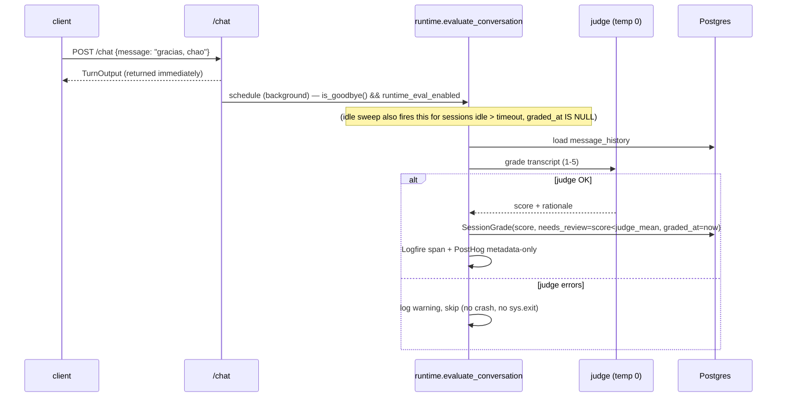

# Evaluation Design

Design for `evaluation`. Realizes `specs/evaluation/requirements.md` (`evaluation-001..020`). Two
subsystems: an **offline pydantic-evals suite** (CI gate) and a **runtime end-of-conversation judge**.
Both score the per-turn `TurnOutput` contract; neither changes it.

## 1. Architecture overview

```
OFFLINE (CI / local):  uv run python -m evals.run
  datasets/*.yaml ──▶ Dataset.evaluate_sync(run_turn) ──▶ run_turn() = the real boundary
  (detect → resolve_active_lang → get_orchestrator().run via GATEWAY → reconcile → TurnOutput)
        └─▶ Evaluators (TaskSuccess, LanguageFidelity, GuardrailHit, SubjectiveQualityJudge)
        └─▶ aggregate metrics + p50/p95 (statistics.quantiles) + cost (RunUsage × price table)
        └─▶ render ONE report (evals/reports/) ─▶ compare THRESHOLDS ─▶ sys.exit(1) on breach

RUNTIME (in the app):  conversation ends (idle timeout OR goodbye intent)
  ─▶ evaluate_conversation(session_id) = judge over message_history ─▶ SessionGrade (Postgres)
  ─▶ Logfire span (content+cost) + PostHog event (metadata-only: score, needs_review)
```

The offline suite runs the **real orchestrator through the gateway** (it measures real quality, not a
TestModel). The runtime judge reuses the same judge module. Logfire instruments both (one trace per
run/turn); PostHog gets metadata-only.

## 2. Repository layout

```
backend/evals/
  config.py            # THE one place: JUDGE_MODEL (+ _CI), JUDGE_TEMPERATURE=0, THRESHOLDS, PRICE_TABLE
  run.py               # `python -m evals.run` entrypoint: evaluate → report → sys.exit(1) on breach
  task.py              # run_turn(inputs) -> TurnOutput dict (mirrors the /chat boundary, no HTTP/DB)
  evaluators.py        # TaskSuccess, LanguageFidelity, GuardrailHit, SubjectiveQualityJudge
  judge.py             # structured int judge agent (output_type=int 1..5, temp 0) + the documented rubric
  report.py            # assemble metrics + render markdown
  datasets/            # happy.yaml, multilingual.yaml (exists), adversarial.yaml
  reports/example-report.md   # committed pre-generated example (gitignored dir except this file)
backend/app/eval/
  runtime.py           # evaluate_conversation(session_id), goodbye-intent detector, idle sweep task
  models.py            # SessionGrade (SQLModel) — or in app/agents/session.py
```

## 3. Component contracts

### 3.1 `backend/evals/config.py` — single source
- `JUDGE_MODEL = "gateway/openai:gpt-4.1-mini"`, `JUDGE_MODEL_CI` (same/cheaper), `JUDGE_TEMPERATURE = 0.0`.
- `THRESHOLDS` dict: `task_success_rate`, `language_fidelity`, `guardrail_precision`, `guardrail_recall`,
  `judge_mean` (1–5), `latency_p95_ms`, `cost_per_conversation_usd`.
- `PRICE_TABLE`: per-model USD per 1M input/output tokens (pinned; gateway/genai-prices coverage is
  uncertain, so we price from `RunUsage` token counts).
- `runtime_eval_enabled` + `conversation_idle_timeout` live in `app/config.py` (the app reads them).

### 3.2 `backend/evals/task.py` — `run_turn(inputs) -> dict`
- The system-under-test. Given `{message, ip, prior_active_lang?}`, it mirrors the `/chat` boundary
  WITHOUT HTTP/DB: `det = LanguageDetector().detect(message)`; build a transient `ConversationSession`;
  `decision = resolve_active_lang(...)`; build `AgentDeps(detection, lang_decision, active_lang, ...)`;
  `result = await get_orchestrator().run(message, deps=deps, usage=RunUsage())`; run the same
  reconciliation the validator does; return `result.output.model_dump()` PLUS attach
  `task_duration` + `usage` so cost/latency evaluators can read them (pydantic-evals records duration;
  usage stashed in case metadata).

### 3.3 `backend/evals/evaluators.py` (deterministic + judge)
- `TaskSuccess(Evaluator)`: expected_output fields match AND `needs_review is False` (unless the case
  expects it) → bool (evaluation-002).
- `LanguageFidelity(Evaluator)`: `lingua` on `output.reply` == `output.active_lang` → bool (evaluation-003, -020).
- `GuardrailHit(Evaluator)`: compares `output.guardrails.{input,output}` to `metadata.must_trip` →
  per-case tp/fp/fn; report.py aggregates into precision/recall (evaluation-004).
- `SubjectiveQualityJudge(Evaluator)`: calls the structured int `judge` (1..5, temp 0) → score
  (evaluation-005). One judge call per case.

### 3.4 `backend/evals/judge.py` — structured int judge
- `judge = Agent(JUDGE_MODEL, output_type=int, model_settings={"temperature": 0}, instructions=<1–5 rubric>)`
  — discrete 1–5 grade (avoids the LLMJudge 0–1 mapping). Pinned model, temp 0 (evaluation-005, -010).
- Documented rubric (5=fully correct + on-language + grounded … 1=harmful/PII-leak/ignores question).
- Reused by the runtime judge over a full transcript.

### 3.5 `backend/evals/run.py` — the gating entrypoint
- `Dataset.from_file` each `datasets/*.yaml`; attach evaluators by `metadata.suite`; `evaluate_sync(run_turn)`.
- Compute metrics: task success %, language fidelity %, guardrail precision/recall (aggregate GuardrailHit),
  judge mean (1–5), latency p50/p95 via `statistics.quantiles`, cost/conversation (Σ per-case cost ÷
  distinct sessions). Render via report.py to `evals/reports/` + print summary (evaluation-001, -006, -009).
- Compare every metric to `THRESHOLDS` (lower-is-better for latency/cost); collect breaches;
  `sys.exit(1)` if any (evaluation-007, -008). CI swaps `JUDGE_MODEL→JUDGE_MODEL_CI` via one env flag.
- IF a judge call errors/times out → record the case un-judged (counts as not-passing), continue
  (evaluation-019).

### 3.6 Runtime judge — `backend/app/eval/runtime.py`
- `async def evaluate_conversation(session_id)`: load `message_history` (from `app.agents.session`),
  render a transcript, call the structured `judge` (temp 0), persist a `SessionGrade`
  (score, rationale, `needs_review = score < THRESHOLDS["judge_mean"]`), emit Logfire span (content/cost)
  + PostHog event (metadata-only) (evaluation-016, -017). Never raises to the caller; never `sys.exit`.
- `def is_goodbye(message, lang) -> bool`: deterministic multilingual keyword/phrase matcher
  (es: "chao/adiós/no necesito más"; en: "bye/that's all/no thanks"; pt: "tchau/obrigado, é só isso") —
  cheap, no LLM (evaluation-015). 
- Idle sweep: an asyncio task started in the `main.py` lifespan (only `WHERE runtime_eval_enabled`),
  every ~60s queries `ConversationSession` with `updated_at < now - conversation_idle_timeout AND
  graded_at IS NULL`, grades each, sets `graded_at` (evaluation-014, -018).
- `app/api/chat.py` (edit): after returning the turn, if `is_goodbye(...)` and `runtime_eval_enabled` →
  schedule `evaluate_conversation` as a background task (do not block the response).

### 3.7 FastAPI / config edits
- `app/config.py`: add `runtime_eval_enabled: bool = True` (flag) + `conversation_idle_timeout: int = 900`.
- `app/main.py` lifespan: start/stop the idle-sweep task when `runtime_eval_enabled`.
- `app/agents/session.py`: add `graded_at: datetime | None = None` to `ConversationSession`.

### 3.8 CI (devops)
- `.github/workflows/ci.yml`: add the eval-gate step `uv run python -m evals.run` on push/PR, with
  `PYDANTIC_AI_GATEWAY_API_KEY` from GitHub Secrets and the CI judge id; pipeline fails on non-zero exit
  (evaluation-012). Keep datasets small to bound per-PR cost.

## 4. Sequence diagrams

### Offline suite (CI gate)
```mermaid
sequenceDiagram
  participant Dev as engineer / CI
  participant Run as evals.run
  participant DS as Dataset
  participant T as run_turn (real agent via gateway)
  participant Ev as Evaluators + judge
  Dev->>Run: uv run python -m evals.run
  Run->>DS: load happy/multilingual/adversarial YAML
  loop each case
    Run->>T: run_turn(inputs)  (detect→resolve→orchestrator→TurnOutput)
    T-->>Run: TurnOutput + duration + usage
    Run->>Ev: TaskSuccess / LanguageFidelity / GuardrailHit / Judge(1-5, temp0)
  end
  Run->>Run: metrics + p50/p95 + cost; render report; compare THRESHOLDS
  alt any breach
    Run-->>Dev: print breaches; sys.exit(1)  (CI fails)
  else all pass
    Run-->>Dev: report + summary; exit 0
  end
```

### Runtime end-of-conversation (goodbye + timeout + failure)


## 5. Data models

```python
# backend/evals/judge.py / shared
class JudgeScore(BaseModel):      # if a rationale is wanted alongside the int
    score: int = Field(ge=1, le=5)
    rationale: str = ""
```
```python
# app/agents/session.py (or app/eval/models.py)
class SessionGrade(SQLModel, table=True):
    id: int | None = Field(default=None, primary_key=True)
    session_id: str = Field(index=True)
    score: int                      # 1..5
    rationale: str = ""
    needs_review: bool = False
    model: str                      # judge model id used
    created_at: datetime
# ConversationSession gains: graded_at: datetime | None = None  (sweep guard)
```
- `THRESHOLDS` / `PRICE_TABLE` = dicts in `backend/evals/config.py`. Datasets = pydantic-evals `Case`
  in committed YAML. No pgvector/`.ics`/event shapes touched.

## 6. Traceability (requirement → component)

| Req | Component(s) |
|---|---|
| evaluation-001 | `run.py` loads all datasets + one report (§3.5) |
| evaluation-002 | `TaskSuccess` evaluator (§3.3) |
| evaluation-003 | `LanguageFidelity` evaluator (§3.3) |
| evaluation-004 | `GuardrailHit` + report.py precision/recall (§3.3, §3.5) |
| evaluation-005 | `SubjectiveQualityJudge` + `judge.py` 1–5 temp0 (§3.3, §3.4) |
| evaluation-006 | `run.py` p50/p95 (`statistics.quantiles`) + cost (PRICE_TABLE×RunUsage) (§3.5) |
| evaluation-007 | `config.py THRESHOLDS` single source (§3.1) |
| evaluation-008 | `run.py` breach check + `sys.exit(1)` (§3.5) |
| evaluation-009 | `report.py` file + summary print (§3.5) |
| evaluation-010 | `judge.py` pinned model + temp 0 in config (§3.1, §3.4) |
| evaluation-011 | `datasets/*.yaml` happy/multilingual/adversarial (§2) |
| evaluation-012 | CI eval-gate step + gateway secret (§3.8) |
| evaluation-013 | committed `reports/example-report.md` (§2, §3.5) |
| evaluation-014 | idle sweep task (§3.6) |
| evaluation-015 | `is_goodbye` + `/chat` background trigger (§3.6) |
| evaluation-016 | `evaluate_conversation` + `SessionGrade` persist (§3.6, §5) |
| evaluation-017 | Logfire span + PostHog metadata-only (§3.6) |
| evaluation-018 | `runtime_eval_enabled` flag gates sweep + trigger (§3.6, §3.7) |
| evaluation-019 | judge error → un-judged, continue (§3.5, §3.6) |
| evaluation-020 | `LanguageFidelity` failure counting (§3.3) |

## 7. Open Decisions / Rejected Alternatives

- **ADK — rejected** (PydanticAI only; not touched here). **PageIndex — deferred** (RAG pgvector-only;
  evaluation does not touch RAG).
- **System-under-test = the real orchestrator via the gateway — chosen** so evals measure real model
  quality. *Rejected:* TestModel (would not measure the model). *Revisit trigger:* per-PR cost — if too
  high, run a sampled subset in CI and the full suite nightly/on-demand.
- **Structured int judge (output_type=int 1..5, temp 0) — chosen** over pydantic-evals `LLMJudge`
  (0–1) to get a discrete documented 1–5 grade without mapping drift.
- **Judge model `gateway/openai:gpt-4.1-mini` (distinct cheaper tier from prod gpt-4.1) — chosen**;
  `JUDGE_MODEL_CI` lets CI use an even cheaper id. *Revisit:* a different provider via the gateway
  (anthropic/google) for lower self-preference bias, once enabled on the account.
- **Runtime timeout via in-app asyncio lifespan sweep + `graded_at` guard — chosen** (simple on a single
  Railway instance). *Rejected:* external cron / multi-instance locking. *Revisit:* horizontal scaling
  (then move to a locked job/queue).
- **Goodbye detection = deterministic multilingual keyword matcher — chosen** (zero LLM cost). *Revisit:*
  a trained intent classifier if keywords miss cases.
- **Cost = pinned PRICE_TABLE × RunUsage tokens — chosen** (gateway/genai-prices coverage uncertain).
  *Revisit:* gateway-reported cost when available.
- **Guardrail precision/recall threshold is DEFERRED until `guardrails` lands** — the `GuardrailHit`
  evaluator + `adversarial.yaml` ship now, but until the `guardrails` feature populates
  `guardrails.{input,output}` the adversarial suite runs **informationally** (its threshold disabled in
  config) to avoid a perpetually-red CI gate. Enforced once `guardrails` is implemented.

## Config (single source)

`backend/evals/config.py`: `JUDGE_MODEL`/`JUDGE_MODEL_CI`/`JUDGE_TEMPERATURE=0`, `THRESHOLDS`,
`PRICE_TABLE`. `app/config.py`: `runtime_eval_enabled` (flag), `conversation_idle_timeout`. Judge model
ids are placeholders confirmed at integration (gateway routing).
