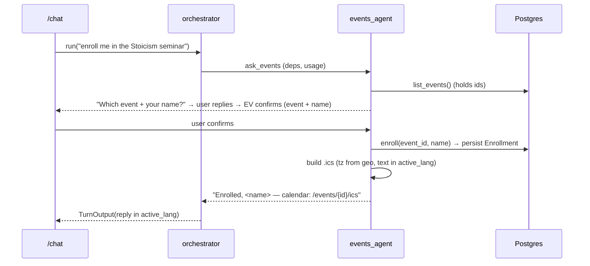
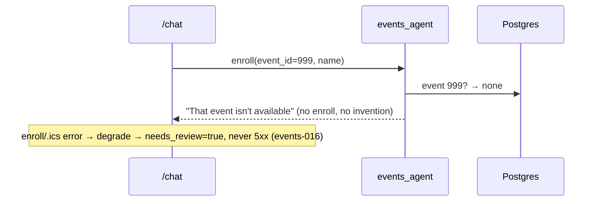

# Events Design

Design for `events`. Realizes `specs/events/requirements.md` (`events-001..018`). An events sub-agent
(orchestrator tool, like FAQ-RAG) that lists events, confirms, enrolls a student by name, and returns a
localized `.ics`; admin CRUD + registrant view; an admin frontend section.

## 1. Architecture overview

```
ADMIN ──X-Admin-Token──▶ FastAPI /events (create/list/delete, GET /events/{id}/enrollments)
                          frontend /admin: events form + list + per-event registrants
STUDENT ──POST /chat──▶ orchestrator ──tool ask_events──▶ events_agent (own per-session memory)
   events_agent tools: list_events() [reads DB, holds ids] · enroll(event_id, name) [confirm-gated]
   enroll → persist Enrollment(session_id,event_id,name,ts) → build .ics (ics lib, tz from geo, text in active_lang)
   reply: confirmation + .ics download link (GET /events/{id}/ics)
            ▼ Logfire spans (events tool, enroll) · PostHog metadata-only (event_id, enrolled bool)
```

Events run via an orchestrator tool (forward `deps`+`usage`, capped by `UsageLimits`). Enroll is
**confirm-before-write**: the agent asks the user to confirm (event + name) and only then calls `enroll`.

## 2. Component contracts

### 2.1 Data models — `app/events/models.py`
- `Event(SQLModel, table=True)`: `id` PK, `title`, `description`, `start_at`, `end_at` (naive-UTC),
  `location`, `timezone` (IANA), `created_at`.
- `Enrollment(SQLModel, table=True)`: `id` PK, `session_id` (indexed), `event_id` (FK, indexed), `name`,
  `created_at`. NO email. Alembic migration `0007` (chains from 0006); delete-event cascades enrollments.

### 2.2 `app/events/ics.py` — `.ics` builder
- `build_ics(*, summary, description, start_at, end_at, location, tz) -> str`: RFC-5545 VCALENDAR via the
  `ics` library (`uv add ics`); times localized to `tz` (the detected timezone). `summary`/`description`
  are passed already in `active_lang` by the agent. (events-011, -012)

### 2.3 `app/agents/events.py` — events sub-agent
- `events_agent = Agent(WORKER_MODEL, deps_type=AgentDeps, output_type=str, instructions="Help with the
  school's events. To enroll, ask the user's name + which event, CONFIRM (event + name) before enrolling,
  call enroll only after the user agrees, never invent an event.")`. Lazy `get_events_agent()`. (events-009, -013)
- `@events_agent.tool list_events(ctx) -> list[...]`: read `Event` rows (id/title/start/end) so the agent
  holds the ids. (events-007)
- `@events_agent.tool enroll(ctx, event_id: int, name: str) -> str`: verify the event exists (else
  message, no write); persist `Enrollment(session_id=ctx.deps.session_id, event_id, name)`; build the
  `.ics` (text in `ctx.deps.active_lang`, tz from `ctx.deps.geo.timezone`); return a confirmation + the
  `.ics` download path. (events-008, -010, -011, -013)

### 2.4 `app/agents/orchestrator.py` (edit) — `ask_events` tool
- `@orchestrator.tool async def ask_events(ctx, request) -> str: r = await get_events_agent().run(
  request, deps=ctx.deps, usage=ctx.usage, message_history=<events history>); ...` — forwards `deps`+`usage`;
  events sub-agent keeps its OWN per-session history (mirror FAQ memory: `events_history_json` +
  `SessionRepository.load/save_events_messages`). Instruction nudge: route event questions to `ask_events`.
  WHERE `events_enabled` is false the tool is not registered. (events-014, -015, -018)

### 2.5 `app/api/events.py` — endpoints
- `POST /events` (admin-token) create; `GET /events` (admin-token) list for the admin UI; `DELETE
  /events/{id}` (admin-token) delete + cascade enrollments; `GET /events/{id}/enrollments` (admin-token)
  registrants (name + ts); `GET /events/{id}/ics` (anonymous) → the event's `.ics` (tz via query or
  default). Missing/invalid admin token on the gated routes → 401/403. (events-001..005, -010)

### 2.6 Frontend — admin events section
- Extend `frontend/app/admin` (reuse the documents-UI pattern + `X-Admin-Token`): an events form
  (create), a list (with delete), and a per-event registrants view (`GET /events/{id}/enrollments`).
  (events-006)

### 2.7 Config / deps
- `events_enabled: bool = True` in `app/config.py`. `AgentDeps` already carries `session`, `session_id`,
  `active_lang`, `geo` (timezone) — all the enroll tool needs.

## 3. Sequence diagrams

### Happy enroll


### Degraded / non-existent event


## 4. Data models

```python
class Event(SQLModel, table=True):
    id: int | None = Field(default=None, primary_key=True)
    title: str; description: str
    start_at: datetime; end_at: datetime         # naive-UTC
    location: str; timezone: str                 # IANA tz
    created_at: datetime = Field(default_factory=now_utc)

class Enrollment(SQLModel, table=True):
    id: int | None = Field(default=None, primary_key=True)
    session_id: str = Field(index=True)
    event_id: int = Field(index=True, foreign_key="event.id")
    name: str                                    # no email
    created_at: datetime = Field(default_factory=now_utc)
```
The `.ics` is a VCALENDAR/VEVENT string (summary, description, DTSTART/DTEND in `tz`, location). Reuses
`now_utc` from `app/time.py`. No pgvector touched.

## 5. Traceability (requirement → component)

| Req | Component |
|---|---|
| events-001 | `POST /events` (§2.5) |
| events-002 | admin-token dependency rejects (§2.5) |
| events-003 | `GET /events` (§2.5) |
| events-004 | `DELETE /events/{id}` + cascade (§2.1, §2.5) |
| events-005 | `GET /events/{id}/enrollments` (§2.5) |
| events-006 | admin frontend events section (§2.6) |
| events-007 | `list_events` tool (§2.3) |
| events-008 | `enroll(event_id, name)` tool (§2.3) |
| events-009 | confirm-before-enroll instruction (§2.3) |
| events-010 | persist Enrollment + `.ics` (§2.3, §2.5) |
| events-011 | `.ics` tz + active_lang text (§2.2, §2.3) |
| events-012 | `ics` lib RFC-5545 (§2.2) |
| events-013 | event-exists check (§2.3) |
| events-014 | `ask_events` forwards deps/usage (§2.4) |
| events-015 | active_lang + fallback (§2.3, §2.4) |
| events-016 | error → degrade needs_review (§2.3, §2.4) |
| events-017 | name-only Enrollment (§2.1) |
| events-018 | `events_enabled` gate (§2.4, §2.7) |

## 6. Open Decisions / Rejected Alternatives

- **ADK — rejected** (PydanticAI only). **PageIndex — deferred** (RAG untouched).
- **Events agent as an orchestrator tool with its own per-session memory — chosen** (mirrors FAQ-RAG;
  consistent). *Rejected:* a separate top-level agent.
- **Conversational confirm-before-enroll — chosen** (the agent asks; `enroll` called only after the user
  agrees). *Rejected:* `pydantic-graph` human-in-the-loop (deferred — heavier than needed); an optional
  `before_tool_execute` hook could harden it later.
- **Name-only enrollment (no email) — chosen** per interview; only `session_id + event_id + name + ts`
  persisted.
- **`.ics` via the `ics` library — chosen** (RFC-5545 correctness, tz handling) over hand-built VCALENDAR.
  Delivered via `GET /events/{id}/ics` (download link in the reply), not embedded in the JSON contract.
- **`.ics` text in `active_lang` produced by the agent** (the stored event text may be in another
  language; the agent writes the summary/description in the session language).
- **Delete-event cascades enrollments — chosen.**

## Config (single source)
`app/config.py`: `events_enabled` (flag). Models in `app/events/models.py`; `.ics` in `app/events/ics.py`;
agent in `app/agents/events.py`; endpoints in `app/api/events.py`; admin UI under `frontend/app/admin`.
