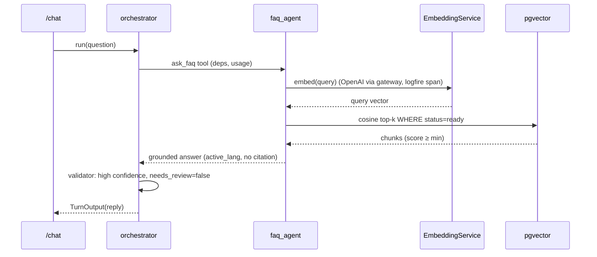

# FAQ-RAG Design

Design for `faq-rag`. Realizes `specs/faq-rag/requirements.md` (`faq-rag-001..018`). A pgvector
retrieval-augmented FAQ agent (orchestrator tool) grounded in admin-uploaded documents, embedded with
**OpenAI text-embedding-3-small** via the gateway (one token). Silent grounding; empty/low retrieval → no hallucination + `needs_review`.

## 1. Architecture overview

```
ADMIN ──(admin token)──▶ FastAPI /documents (upload/list/delete/update)
   upload → 202 Accepted → BACKGROUND ingest job: extract → chunk → embed(OpenAI via gateway) → pgvector rows
                                                   (status: pending→ingesting→ready|failed)
STUDENT ──POST /chat──▶ orchestrator ──tool ask_faq──▶ faq_agent
   faq_agent ──tool retrieve(query)──▶ EmbeddingService.embed(query) → pgvector cosine top-k (status=ready)
   grounded answer in active_lang (no citation) ──▶ orchestrator output_validator:
        retrieval signal on deps → damp confidence_score + needs_review on empty/low retrieval
            ▼
   Logfire spans (ingest job, embed calls via httpx, retrieve SQL) · PostHog metadata-only
```

Retrieval + embedding run inside Logfire-instrumented spans. Ingestion is a **background job, never
inline** in the upload request. The FAQ agent is an **orchestrator tool** (`deps`+`usage` forwarded).

## 2. Component contracts

### 2.1 Data models — `app/rag/models.py`
- `class Document(SQLModel, table=True)`: `id` (uuid/int PK), `name`, `content_type` (`pdf|md|txt`),
  `status` (`pending|ingesting|ready|failed`), `error` (str|None), `created_at`, `updated_at` (naive-UTC).
- `class DocumentChunk(SQLModel, table=True)`: `id` PK, `document_id` (FK, indexed), `ordinal` (int),
  `text` (str), `embedding` (pgvector `Vector(embedding_dim)`), `created_at`. **HNSW index** on
  `embedding` with `vector_cosine_ops`.
- Alembic migration `0005`: `CREATE EXTENSION IF NOT EXISTS vector` (already enabled in 0001), the two
  tables + the HNSW index. (faq-rag-005)

### 2.2 `app/rag/embeddings.py` — `EmbeddingService`
- `async embed(texts: list[str]) -> list[list[float]]`: wraps `pydantic_ai.Embedder(embedding_model)`
  (`gateway/openai:text-embedding-3-small`, dim `embedding_dim`=1536) — routed through the SAME gateway
  token as the chat models (one credential), via `embed_documents` / `embed_query`, inside a
  `logfire.span`. Pure I/O; raises a typed error the callers handle (ingest → mark failed; query →
  degrade). (faq-rag-005, -017)

### 2.3 `app/rag/ingest.py` — background ingestion
- `extract_text(content, content_type)` (pypdf for PDF; decode for md/txt) → `chunk(text, chunk_size,
  chunk_overlap)` → `EmbeddingService.embed(chunks)` → insert `DocumentChunk` rows; set `Document.status`
  `ingesting`→`ready`. On any failure → `status="failed"`, store `error`, leave the rest of the corpus
  usable. (faq-rag-003, -004, -018)
- `reingest_and_swap(document_id, new_content)`: ingest into NEW chunk rows under a new/parallel
  document version, flip retrieval to the new `ready` rows, then delete the old (immutable docs).
  (faq-rag-008)

### 2.4 `app/rag/retrieve.py` — retrieval
- `async retrieve(db, query, *, k, similarity_min, hybrid) -> list[Hit]` (`Hit`: chunk text + score):
  `EmbeddingService.embed([query])` → SQL `SELECT ... ORDER BY embedding <=> :qvec LIMIT :k` filtered to
  `Document.status == "ready"`; drop hits below `similarity_min`. WHERE `hybrid` → also keyword score
  (Postgres `ILIKE`/`ts_rank`) and combine before ranking. (faq-rag-009, -016)

### 2.5 `app/agents/faq.py` — the FAQ-RAG agent
- `faq_agent = Agent(WORKER_MODEL, deps_type=AgentDeps, output_type=str, instructions="Answer ONLY from
  the retrieved chunks; if none are relevant, say you do not have that information; reply in active_lang;
  NEVER cite the source.")`. (faq-rag-010, -012, -013)
- `@faq_agent.tool async def retrieve_chunks(ctx, query) -> list[str]`: calls `retrieve(...)`, records the
  top score + hit count on `ctx.deps.rag` (the retrieval signal), returns the chunk texts (empty list when
  no hit ≥ threshold → the agent says "no info"). (faq-rag-009, -011)

### 2.6 `app/agents/orchestrator.py` (edit) — `ask_faq` tool + reconciliation
- `@orchestrator.tool async def ask_faq(ctx, question) -> str: r = await faq_agent.run(question,
  deps=ctx.deps, usage=ctx.usage); return r.output` — forwards `deps`+`usage`; capped by the existing
  `UsageLimits`. (faq-rag-014)
- A reconciliation step (extend the output_validator, mirroring geo/lang): read `ctx.deps.rag` — if
  retrieval was empty or below threshold, **lower `confidence_score`** and **set `needs_review=true`**
  (faq-rag-011, -015). Anti-hallucination is enforced by the agent instructions + empty-retrieval path.

### 2.7 `app/api/documents.py` — admin endpoints (admin-token dependency)
- `POST /documents` (multipart upload; validate `pdf|md|txt`) → create `Document(status=pending)` →
  schedule the background ingest → `202`. `GET /documents` → list (id/name/status). `DELETE
  /documents/{id}` → remove doc + chunks. `PUT /documents/{id}` → `reingest_and_swap`. All require the
  admin token; missing/invalid → `401/403` and NO mutation. (faq-rag-001, -002, -006, -007, -008)

### 2.8 `app/deps.py` (edit) + `app/config.py` (edit)
- `AgentDeps.rag: RagSignal` (a small mutable holder: `max_score: float|None`, `hit_count: int`).
- Config: `hybrid_retrieval` (flag, default false), `rag_top_k` (5), `rag_similarity_min`,
  `embedding_model` (`gateway/openai:text-embedding-3-small`), `embedding_dim` (1536), `chunk_size`, `chunk_overlap`.

## 3. Sequence diagrams

### Happy query (grounded answer)


### Anti-hallucination (out-of-corpus) + ingestion
```mermaid
sequenceDiagram
  participant API as /chat
  participant FAQ as faq_agent
  participant DB as pgvector
  API->>FAQ: ask_faq("question not in docs")
  FAQ->>DB: cosine top-k
  DB-->>FAQ: no chunk ≥ similarity_min (empty)
  FAQ-->>API: "I don't have that information" (no invention)
  Note over API: deps.rag empty → validator: confidence_score↓, needs_review=true
  Note over API: (ingest) admin upload → 202 → background: extract→chunk→embed→rows status ready;<br/>failure → status=failed, corpus stays usable
```

## 4. Data models

```python
from pgvector.sqlalchemy import Vector
from sqlmodel import Field, SQLModel, Column

class Document(SQLModel, table=True):
    id: int | None = Field(default=None, primary_key=True)
    name: str
    content_type: str            # pdf | md | txt
    status: str = "pending"      # pending | ingesting | ready | failed
    error: str | None = None
    created_at: datetime
    updated_at: datetime

class DocumentChunk(SQLModel, table=True):
    id: int | None = Field(default=None, primary_key=True)
    document_id: int = Field(index=True, foreign_key="document.id")
    ordinal: int
    text: str
    embedding: list[float] = Field(sa_column=Column(Vector(1536)))  # embedding_dim (text-embedding-3-small)
    created_at: datetime
# HNSW index (cosine) created in migration 0005; embedding_dim fixed by the model (text-embedding-3-small @ 1536).

class RagSignal(BaseModel):      # on AgentDeps; written by retrieve_chunks, read by the validator
    max_score: float | None = None
    hit_count: int = 0
```
No `.ics`/event shapes touched. Writes contract fields `reply`, `confidence_score`, `needs_review`.

## 5. Traceability (requirement → component)

| Req | Component(s) |
|---|---|
| faq-rag-001 | `POST /documents` admin upload (§2.7) |
| faq-rag-002 | admin-token dependency rejects (§2.7) |
| faq-rag-003 | background ingest job (§2.3, §2.7) |
| faq-rag-004 | retrieve filters `status==ready` (§2.4) |
| faq-rag-005 | `EmbeddingService` + pgvector HNSW + migration (§2.1, §2.2) |
| faq-rag-006 | `GET /documents` list (§2.7) |
| faq-rag-007 | `DELETE /documents/{id}` (§2.7) |
| faq-rag-008 | `reingest_and_swap` (§2.3, §2.7) |
| faq-rag-009 | `retrieve` cosine top-k (§2.4) |
| faq-rag-010 | `faq_agent` grounded instructions (§2.5) |
| faq-rag-011 | empty-retrieval path + validator (§2.5, §2.6) |
| faq-rag-012 | answer in `active_lang` + fallback (§2.5) |
| faq-rag-013 | "never cite" instruction (§2.5) |
| faq-rag-014 | `ask_faq` forwards deps/usage (§2.6) |
| faq-rag-015 | `RagSignal` → confidence damp (§2.6) |
| faq-rag-016 | `hybrid` branch in retrieve (§2.4) |
| faq-rag-017 | embed error → degrade (§2.2, §2.6) |
| faq-rag-018 | ingest failure → `status=failed` (§2.3) |

## 6. Open Decisions / Rejected Alternatives

- **ADK — rejected** (PydanticAI only). **PageIndex — deferred**: RAG is pgvector-only (HNSW, cosine,
  hybrid-ready) now; PageIndex (structural/recursive index) is a documented upgrade path, not built.
- **OpenAI `text-embedding-3-small` via the Pydantic AI Gateway — chosen** (resolved during impl):
  embeddings go through the SAME `PYDANTIC_AI_GATEWAY_API_KEY` as the chat models (one token), consumed
  via `pydantic_ai.Embedder`, @ **1536 dims** (fixed pgvector column). *Rejected:* **Gemini**
  `text-embedding-004` — although picked first ("best quality"), Gemini embeddings need a SEPARATE
  `GOOGLE_API_KEY` (the gateway token does not cover them), which breaks the one-token / gateway-only
  goal; not worth the extra credential here. Also rejected: local sentence-transformers (heavy torch
  dep + big image). *Revisit:* Gemini (`text-embedding-004`/`gemini-embedding-001`) + a `GOOGLE_API_KEY`
  if embedding quality ever needs it — requires a column dim change + full re-embed.
- **Pure pgvector cosine top-k; hybrid behind `hybrid_retrieval` — chosen** (simple, enough for FAQ).
  *Rejected:* hybrid-by-default (more to build/tune). HNSW with `vector_cosine_ops`.
- **Silent grounding (no source citation) — chosen** per the interview. *Rejected:* inline citations
  (cleaner reply preferred). *Revisit:* if auditability/traceability is required later.
- **Retrieval confidence → contract via a `RagSignal` on deps + output_validator — chosen** (mirrors the
  geo/lang reconciliation) so `confidence_score`/`needs_review` reflect retrieval quality without the
  sub-agent owning the contract.
- **Ingestion = FastAPI `BackgroundTasks` (single instance) — chosen** (simple, no broker). *Rejected:*
  Celery/RQ/external queue (overkill now). *Revisit:* large docs / horizontal scale → a real job queue.
- **Chunking = fixed-size char/token windows with overlap — chosen** (robust, simple). *Revisit:*
  semantic/structural chunking (the PageIndex path).
- **Update = re-ingest into new rows + atomic swap + delete old — chosen** (ingested docs immutable).

## Config (single source)

`app/config.py`: `hybrid_retrieval` (flag), `rag_top_k`, `rag_similarity_min`, `embedding_model`
(`gateway/openai:text-embedding-3-small`), `embedding_dim` (1536), `chunk_size`, `chunk_overlap`. Embeddings are gateway-routed (one token, via `pydantic_ai.Embedder`);
the exact embeddings transport is confirmed at integration. Model ids are placeholders per convention.
