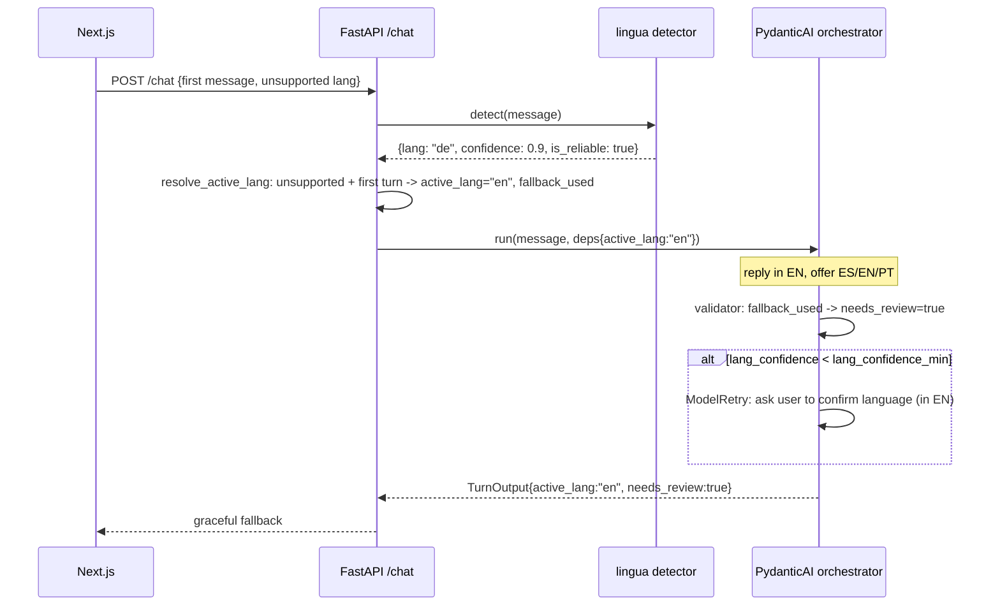

# Multilingual Design

Design for the `multilingual` feature. Realizes `specs/multilingual/requirements.md`
(`multilingual-001..014`). Scope = the **language** fields of the per-turn contract
(`detected_lang`, `active_lang`, `lang_confidence`) + the language-related `needs_review`
triggers. Country/geo fusion is owned by `orchestrator-and-fusion`.

## 1. Architecture overview

`multilingual` is realized at the **request → agent boundary** plus the **orchestrator's
dynamic instructions + output_validator** plus a **deterministic language module** and
**per-session language state**. Runtime path:

```
Next.js chat UI ──POST /chat──▶ FastAPI boundary ──▶ PydanticAI orchestrator (agent-as-tool
  to FAQ-RAG / EVENTS) ──▶ Postgres (ConversationSession + message_history)
```

The deterministic detector (`lingua`) runs **once, pre-agent** (fast, no LLM round-trip).
Its result + session state decide a provisional `active_lang`, which is injected into the
orchestrator's instructions so the model replies in the right language. After the run, an
`output_validator` fuses the LLM's self-reported `detected_lang` with the detector to set
`lang_confidence` (agreement score) and the language `needs_review` triggers, and repairs the
reply language if the model drifted. Logfire spans wrap the detector call and the agent run
(one trace per turn); PostHog gets a metadata-only `turn_completed` event
(`active_lang`, `detected_lang`, `lang_confidence`, `needs_review` — never message content).

## 2. Component contracts

### 2.1 `LanguageDetector` — deterministic lingua wrapper (`app/lang/detector.py`)
- **In:** `text: str`. **Out:** `DetectionResult{lang, confidence, is_reliable, method, error}`.
- Loads a `lingua` `LanguageDetectorBuilder` for a bounded language set (the 3 supported +
  common confusables). `detect(text)` returns the top language + confidence.
- **Errors:** never raises to the caller — on any exception returns `DetectionResult(lang=None,
  confidence=0.0, is_reliable=False, error=...)` (drives `multilingual-012`).
- Short input → `is_reliable=False` when `len(text) < config.min_input_chars` (`multilingual-011`).
- Pure + sync; lives in `AgentDeps` so it is injected, not global.

### 2.2 `compute_lang_confidence(llm_lang, det) -> float` (`app/lang/fusion.py`)
- **In:** `llm_lang: str` (LLM self-report), `det: DetectionResult`. **Out:** `float` in `[0,1]`.
- Rules: detector failed/`None` → low (≈0.3); detector unreliable (short) → moderate, weighting the
  LLM signal; `llm_lang == det.lang` → high (`≈0.6 + 0.4*det.confidence`); disagreement → low
  (`≈1 - det.confidence`). Exact weights tuned against the eval dataset (open decision). This is the
  `lang_confidence` agreement score (`multilingual-005`).

### 2.3 `resolve_active_lang(session, det, config) -> ActiveLangDecision` (`app/lang/state.py`)
Pure state machine deciding `active_lang` **before** the agent runs:
- **First turn** (no locked `active_lang`): supported+reliable `det.lang` → lock to it
  (`multilingual-004`); unsupported `det.lang` → `active_lang = config.fallback_lang` (`en`),
  `fallback_used=True` (`multilingual-009`).
- **Locked session**: base = `session.active_lang` (`multilingual-007`). If `lang_autoswitch` is
  **off** → keep it regardless (`multilingual-014`). If **on** → count consecutive turns in a new
  supported language and switch only at `autoswitch_min_turns` (2) (`multilingual-013`). Unsupported
  `det.lang` on a locked session → keep `active_lang`, set a needs_review reason (`multilingual-008`).
  Short input → no switch, keep `active_lang` (`multilingual-011`).
- **Out:** `ActiveLangDecision{active_lang, first_turn, locked, switched, fallback_used, reasons[]}`.

### 2.4 Orchestrator agent — instructions + output_validator (`app/agents/orchestrator.py`)
- `Agent(ORCHESTRATOR_MODEL, deps_type=AgentDeps, output_type=TurnOutput, instructions=..., retries=2)`.
- **Dynamic instructions** (`@orchestrator.instructions`) inject `ctx.deps.active_lang`:
  "Reply ONLY in `{active_lang}`; self-report `detected_lang` for what the user wrote this turn."
- **`@orchestrator.output_validator`** (guards `ctx.partial_output` first):
  1. `lang_confidence = compute_lang_confidence(output.detected_lang, ctx.deps.detection)` (`-005`).
  2. Enforce `output.active_lang == ctx.deps.active_lang`; deterministically check the reply language
     (`detector.detect(output.reply)`); on mismatch `raise ModelRetry(...)` to rewrite in `active_lang`
     (`-006`, `-007`).
  3. `needs_review=True` when: `decision.fallback_used` (`-008/-009`), detector failed (`-012`), or
     `lang_confidence < config.lang_confidence_min` — in the last case, if the reply is not already a
     language-clarification, `raise ModelRetry("ask the user to confirm their language in {active_lang}")`
     once (`-010`).
- Forwarding: sub-agent (FAQ/EVENTS) tools are run with `deps=ctx.deps, usage=ctx.usage` and the run is
  capped by `UsageLimits(...)` (per pydantic-ai-conventions). `final_normalized_text`/`detected_country`/
  `confidence_score` are populated by `orchestrator-and-fusion`; this feature leaves them at their
  contract defaults while still emitting all nine fields (`-001`).

### 2.5 Session persistence (`app/agents/session.py`)
- `ConversationSession` SQLModel row read at request start, updated after the turn with
  `decision.active_lang`, refreshed `last_supported_lang`, and the auto-switch counters.
- Message history via `save_messages(session_id, result.all_messages())` / `load_messages(...)`
  (pydantic-ai-conventions §8) — replayed with `message_history=` for coherence.

### 2.6 FastAPI boundary (`app/api/chat.py`)
- `POST /chat {session_id, message}` → load session+history → detect → `resolve_active_lang` → build
  `AgentDeps(active_lang=decision.active_lang, detection=det, ...)` → `orchestrator.run(...)`.
- Catches `ModelHTTPError | UnexpectedModelBehavior | UsageLimitExceeded` → `degraded_turn(active_lang=
  deps.active_lang)` with `needs_review=True` (never a 500). Returns `TurnOutput`.

## 3. Data models

```python
from typing import Literal
from pydantic import BaseModel, Field

class DetectionResult(BaseModel):
    lang: str | None                       # ISO 639-1 or None on failure
    confidence: float = Field(ge=0, le=1)
    is_reliable: bool
    method: Literal["lingua"] = "lingua"
    error: str | None = None

class ActiveLangDecision(BaseModel):
    active_lang: str                       # es | en | pt
    first_turn: bool
    locked: bool
    switched: bool = False
    fallback_used: bool = False
    reasons: list[str] = Field(default_factory=list)
```

```python
# app/agents/session.py
from sqlmodel import SQLModel, Field
from datetime import datetime

class ConversationSession(SQLModel, table=True):
    id: str = Field(primary_key=True)              # session_id
    active_lang: str | None = None
    last_supported_lang: str | None = None
    pending_switch_lang: str | None = None
    pending_switch_count: int = 0
    created_at: datetime
    updated_at: datetime
```

`AgentDeps` (from pydantic-ai-conventions) is extended for this feature with
`detection: DetectionResult` and `lang_decision: ActiveLangDecision` (so the validator reads both
signals). `TurnOutput` is the canonical contract from the `json-contract` skill — unchanged.
No pgvector tables are touched by this feature.

## 4. Sequence diagrams

### Happy path
```mermaid
sequenceDiagram
  participant UI as Next.js
  participant API as FastAPI /chat
  participant Det as lingua detector
  participant Orc as PydanticAI orchestrator
  participant DB as Postgres
  UI->>API: POST /chat {session_id, message}
  API->>DB: load ConversationSession + message_history
  API->>Det: detect(message)
  Det-->>API: DetectionResult{lang, confidence, is_reliable}
  API->>API: resolve_active_lang(session, det) -> active_lang
  API->>Orc: run(message, deps{active_lang, detection}, history, UsageLimits)
  Note over Orc: instructions: reply in active_lang; self-report detected_lang
  Orc->>Orc: output_validator: lang_confidence=agreement; enforce reply==active_lang
  Orc-->>API: TurnOutput (all 9 fields)
  API->>DB: update session(active_lang,...) + save_messages(all_messages())
  API-->>UI: TurnOutput  (Logfire trace/turn; PostHog metadata-only)
```

### Degraded path — unsupported language + low confidence

Detector failure (`multilingual-012`) follows the same shape: `DetectionResult(lang=None)` →
validator sets low `lang_confidence` + `needs_review=true`, falling back to the LLM `detected_lang`.

## 5. Traceability (requirement → component)

| Req | Component(s) |
|---|---|
| multilingual-001 | `TurnOutput` output_type emitted on every `/chat` turn (§2.4, §2.6) |
| multilingual-002 | LLM self-report `detected_lang`, reconciled in output_validator (§2.4) |
| multilingual-003 | `resolve_active_lang` constrains to es/en/pt or fallback (§2.3) |
| multilingual-004 | `resolve_active_lang` first-turn lock (§2.3) |
| multilingual-005 | `compute_lang_confidence` (§2.2) called in output_validator (§2.4) |
| multilingual-006 | output_validator reply-language enforcement + recompute (§2.4) |
| multilingual-007 | locked `active_lang` from `ConversationSession` + dynamic instructions (§2.3, §2.5) |
| multilingual-008 | `resolve_active_lang` locked+unsupported → keep + needs_review (§2.3, §2.4) |
| multilingual-009 | `resolve_active_lang` first-turn+unsupported → fallback `en` + needs_review (§2.3) |
| multilingual-010 | output_validator low-confidence clarification + ModelRetry (§2.4) |
| multilingual-011 | `LanguageDetector.is_reliable` short-input + `resolve_active_lang` no-switch (§2.1, §2.3) |
| multilingual-012 | `LanguageDetector` error path + output_validator (§2.1, §2.4) |
| multilingual-013 | `resolve_active_lang` autoswitch counter behind `lang_autoswitch` (§2.3) |
| multilingual-014 | `resolve_active_lang` hard-lock when autoswitch off (§2.3) |

## 6. Open Decisions / Rejected Alternatives

- **ADK — rejected.** Google ADK and PydanticAI are competing runtimes that do not compose
  in-process (only A2A as separate HTTP services). We use PydanticAI only.
- **PageIndex — deferred.** Not touched by this feature; RAG remains pgvector-only (recorded for
  consistency; revisited only in `faq-rag`).
- **Detection strategy — chosen:** deterministic lingua **pre-agent** + LLM self-report fused in the
  output_validator. *Rejected:* detection-as-a-tool (extra LLM round-trip, less deterministic);
  LLM-only detection (no independent signal → cannot compute `lang_confidence` as an agreement score).
- **Session language state — chosen:** dedicated `ConversationSession` table (explicit `active_lang`
  + switch counters). *Rejected:* deriving `active_lang` from `message_history` (implicit, hard to test).
- **Lock policy — chosen:** hard session lock by default; auto-switch behind the `lang_autoswitch`
  flag (≥2 consecutive turns). *Revisit trigger:* UX feedback that the hard lock is too rigid.
- **Open (tuned against the eval dataset):** the `compute_lang_confidence` weights and
  `lang_confidence_min` (default `0.55`); `min_input_chars` short-input floor; the lingua language
  subset to load (memory/latency vs. all-languages).

## Config (single source — `app/config.py` / `app/agents/config.py`)

`supported = ("es", "en", "pt")`; `fallback_lang = "en"`; `lang_confidence_min = 0.55`;
`min_input_chars = 12`; `lang_autoswitch = False` (flag); `autoswitch_min_turns = 2`. Model ids stay
in the one model-config module (pydantic-ai-conventions §1).
