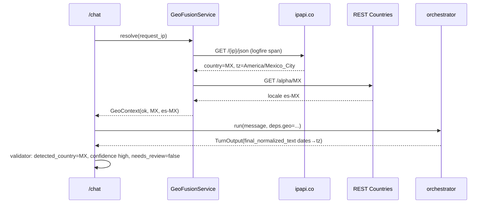
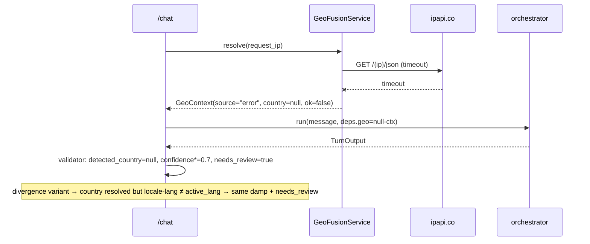

# Orchestrator & Signal-Fusion Design

Design for `orchestrator-and-fusion`. Realizes `specs/orchestrator-and-fusion/requirements.md`
(`orchestrator-and-fusion-001..017`). Fuses two external APIs (ipapi.co geo-IP + REST Countries
locale) into the per-turn contract's `detected_country` / `final_normalized_text` / `confidence_score`,
with deterministic reconciliation in the orchestrator's `output_validator`.

## 1. Architecture overview

```
Next.js ──POST /chat──▶ FastAPI boundary
  1. guardrails (existing)                       ← input guardrails
  2. GeoFusionService.resolve(request_ip)        ← DETERMINISTIC, inside logfire.span("geo_fusion")
       ipapi.co (country/tz/locale) → REST Countries (locale variant) → GeoContext
       (timeout-bounded, per-IP cached, private-IP/flag short-circuit, never raises)
  3. AgentDeps(geo=GeoContext, ...) ─▶ orchestrator.run()
       dynamic instruction injects geo.locale + geo.timezone so the LLM writes
       final_normalized_text with relative dates resolved to the detected timezone
  4. output_validator _reconcile_fusion(deps.geo, output, lang_confidence):
       detected_country = geo.country; confidence_score = deterministic rules;
       needs_review on geo-error / locale↔active_lang divergence / unsupported lang
  5. output guardrails (existing) ─▶ TurnOutput
            ▼
   Logfire: one trace/turn (geo_fusion span + httpx spans for both APIs) · PostHog: metadata only
```

Geo fusion runs **deterministically at the boundary** (not as an LLM-invoked tool) so
`detected_country` is always populated and reproducible for evals; the constitution's "inside a tool /
traceable span" intent is met by the `logfire.span` + instrumented `httpx`. The LLM only authors
`final_normalized_text` (using the injected locale/timezone); `detected_country` and `confidence_score`
are set by code, never guessed by the model.

## 2. Component contracts

### 2.1 `app/fusion/geo.py` — `GeoFusionService` + `GeoContext`
- `class GeoContext(BaseModel)`: `country: CountryAlpha2 | None`, `timezone: str | None`,
  `locale: str | None` (e.g. `pt-BR`), `source: Literal["ipapi","cache","disabled","private_ip","error"]`,
  `ok: bool`.
- `class GeoFusionService`: `__init__(self, http: httpx.AsyncClient, settings: Settings)`.
  `async resolve(ip) -> GeoContext`:
  - WHERE `not settings.geo_fusion_enabled` → `GeoContext(source="disabled", ok=False)` (no call) (req-015).
  - Private/loopback/invalid IP (`ipaddress` check) → `GeoContext(source="private_ip", ok=False)` (no call) (req-010).
  - Per-IP cache hit → `source="cache"` (req-017).
  - Else call **ipapi.co** `GET {ipapi_base_url}/{ip}/json/` (timeout `geo_timeout`) → country + timezone +
    languages. WHERE `rest_countries_enabled` enrich locale variant via **REST Countries**
    `GET {rest_countries_base_url}/alpha/{cc}` (req-004); else default locale (req-016).
  - On HTTP error / timeout / bad payload → `GeoContext(source="error", ok=False)` (req-009). NEVER raises.
  - Both calls go through the shared `deps.http` (instrumented by `logfire.instrument_httpx`), wrapped in
    `logfire.span("geo_fusion")` (req-003).

### 2.2 `app/fusion/reconcile.py` — deterministic `confidence_score`
- `def reconcile(geo, lang_confidence, active_lang, detection, lang_fallback_used) -> ReconcileResult`
  (`confidence_score: float`, `needs_review: bool`, `divergence: bool`). Pure function (req-008):
  - start `score = lang_confidence` (read from multilingual; this feature does not own it).
  - `geo.ok and geo.country`: if the country's primary language is consistent with `active_lang` (or
    unknown) → keep high; else **divergence** → `score *= 0.6`, `needs_review=True` (req-011).
  - `geo.source == "error"` → `score *= 0.7`, `needs_review=True` (req-009).
  - `geo.source in {"private_ip","disabled"}` → no penalty, no `needs_review` (expected) (req-010,-015).
  - `lang_fallback_used` (unsupported language) → `needs_review=True` (preserve multilingual) (req-014).
  - clamp `[0,1]`. High agreement (lang≈ + geo ok + no divergence) → high score (req-007).

### 2.3 `app/deps.py` (edit) — `AgentDeps.geo: GeoContext`
- Add a `geo: GeoContext` field carried into the run so instructions + the validator can read it.

### 2.4 `app/agents/orchestrator.py` (edit)
- New `@orchestrator.instructions` injecting `ctx.deps.geo.locale` + `geo.timezone` + the current time,
  instructing the model to set `final_normalized_text` to the cleaned user text with **relative
  temporal expressions resolved to absolute values in that timezone**, in `active_lang` (req-005,-006,-014).
- Extend the `output_validator` (`_reconcile_fusion`, runs after the existing language reconciliation;
  guard `ctx.partial_output` first): set `output.detected_country = deps.geo.country`; call
  `reconcile(...)` → set `output.confidence_score` + OR `output.needs_review`; if
  `final_normalized_text` is empty, fall back to the raw message (never empty) (req-001,-008,-013).

### 2.5 `app/api/chat.py` (edit)
- After input guardrails, before the orchestrator run: `geo = await GeoFusionService(http, settings).resolve(request_ip)`; build `AgentDeps(..., geo=geo)`. The degrade path also carries `geo` so a degraded turn still reports `detected_country` (req-013).

### 2.6 `app/config.py` (edit)
- `geo_fusion_enabled: bool = True`, `rest_countries_enabled: bool = True`, `ipapi_base_url`,
  `rest_countries_base_url`, `geo_timeout: float = 3.0`, `default_locale`, `default_timezone`.

### 2.7 `backend/evals/task.py` (edit)
- `run_turn` resolves geo the same way (mirror) so eval Cases populate `detected_country` /
  `confidence_score`; criterion 006 is tested by injecting a fixed "now".

## 3. Sequence diagrams

### Happy path (geo resolved)


### Degraded (geo-IP timeout / divergence)


## 4. Data models

```python
from typing import Literal
from pydantic import BaseModel
from pydantic_extra_types.country import CountryAlpha2

class GeoContext(BaseModel):
    country: CountryAlpha2 | None = None
    timezone: str | None = None
    locale: str | None = None          # e.g. "pt-BR"
    source: Literal["ipapi", "cache", "disabled", "private_ip", "error"] = "error"
    ok: bool = False

class ReconcileResult(BaseModel):
    confidence_score: float
    needs_review: bool
    divergence: bool = False
```
No DB models, no pgvector, no `.ics` shapes touched. Writes contract fields `detected_country`,
`final_normalized_text`, `confidence_score`, `needs_review`.

## 5. Traceability (requirement → component)

| Req | Component(s) |
|---|---|
| orchestrator-and-fusion-001 | validator populates all 3 fields (§2.4) |
| orchestrator-and-fusion-002 | `GeoFusionService.resolve` ipapi.co (§2.1) |
| orchestrator-and-fusion-003 | `logfire.span("geo_fusion")` + instrumented httpx (§2.1) |
| orchestrator-and-fusion-004 | REST Countries enrichment (§2.1) |
| orchestrator-and-fusion-005 | instruction → `final_normalized_text` + validator fallback (§2.4) |
| orchestrator-and-fusion-006 | instruction relative-date resolution via geo.timezone (§2.4) |
| orchestrator-and-fusion-007 | `reconcile` high-agreement branch (§2.2) |
| orchestrator-and-fusion-008 | `reconcile` deterministic rules in validator (§2.2, §2.4) |
| orchestrator-and-fusion-009 | `resolve` error → null + `reconcile` damp+review (§2.1, §2.2) |
| orchestrator-and-fusion-010 | private-IP short-circuit (§2.1, §2.2) |
| orchestrator-and-fusion-011 | `reconcile` divergence branch (§2.2) |
| orchestrator-and-fusion-012 | REST Countries fail → default locale + review (§2.1, §2.2) |
| orchestrator-and-fusion-013 | never-raise + boundary degrade carries geo (§2.1, §2.4, §2.5) |
| orchestrator-and-fusion-014 | active_lang consistency + fallback review (§2.2, §2.4) |
| orchestrator-and-fusion-015 | `geo_fusion_enabled` short-circuit (§2.1) |
| orchestrator-and-fusion-016 | `rest_countries_enabled` default locale (§2.1) |
| orchestrator-and-fusion-017 | per-IP cache (§2.1) |

## 6. Open Decisions / Rejected Alternatives

- **ADK — rejected** (PydanticAI only). **PageIndex — deferred** (RAG untouched here).
- **Deterministic boundary fusion (Logfire-traced `GeoFusionService`) — chosen** over an LLM-invoked
  PydanticAI tool: guarantees `detected_country` is populated every turn and is reproducible for the
  eval. *Rejected:* an LLM-discretion tool (the model might skip it). The "inside a tool" intent (one
  traceable span) is satisfied by `logfire.span` + instrumented `httpx`.
- **`detected_country` + `confidence_score` set by code (validator), `final_normalized_text` by the LLM
  — chosen**: the model must not guess geo; it only normalizes text/dates with the injected locale.
- **ipapi.co keyless — chosen** (no extra secret, HTTPS, returns country+tz+locale). *Tradeoff:* free-tier
  rate limits → mitigated by per-IP cache + timeout. *Revisit:* `ipinfo.io` + token if limits bite.
- **`confidence_score` = deterministic reconciliation rules — chosen** over a weighted formula
  (arbitrary weights, harder to test 1:1).
- **Relative-date resolution done by the LLM using the injected timezone — chosen**; the eval injects a
  fixed "now" for determinism. *Rejected:* a hand-written locale-aware date parser (brittle per
  language). *Revisit:* if the LLM date resolution proves unreliable in evals.
- **Per-IP cache = process-level LRU with TTL — chosen** (simple, cuts cost/latency + rate-limit risk).
  *Revisit:* a shared cache on horizontal scaling.
- **Private/loopback IP → `detected_country=null`, NO `needs_review` — chosen** (expected in dev; not an
  error). Geo-API *errors* DO set `needs_review`.

## Config (single source)

`app/config.py`: `geo_fusion_enabled`/`rest_countries_enabled` (flags), `ipapi_base_url`,
`rest_countries_base_url`, `geo_timeout`, `default_locale`, `default_timezone`. Supported languages
remain single-sourced in `config.py` (`SUPPORTED_LANGS`). Model ids stay gateway-only.
