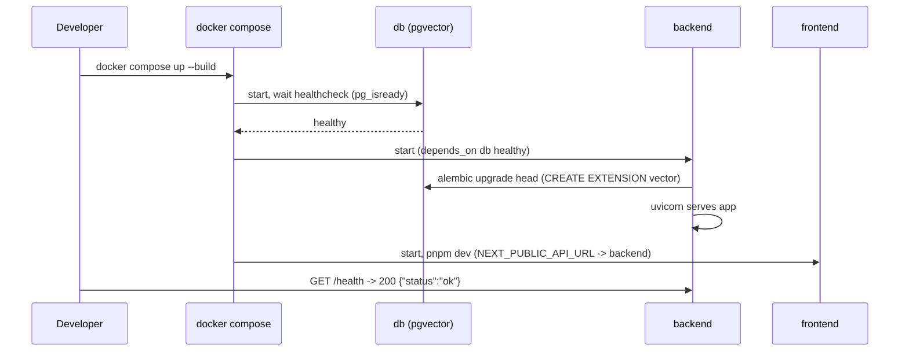
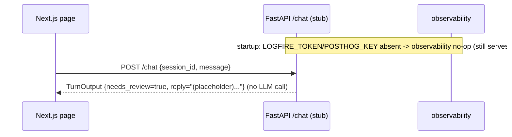

# Platform Scaffold Design

Design for `platform-scaffold`. Realizes `specs/platform-scaffold/requirements.md`
(`platform-scaffold-001..019`). This feature is **infrastructure**: it stands up the monorepo, the
contract seam, the local Docker runtime, the Alembic baseline, and CI. It builds **no** agent,
language, RAG, or guardrail logic — the `POST /chat` endpoint is a typed **stub**.

## 1. Architecture overview

Establishes the full runtime path as an empty-but-bootable skeleton:

```
Next.js (frontend/, pnpm) ──POST /chat──▶ FastAPI (backend/, uv) ──▶ Postgres (pgvector)
        │                                        │
   chat page                            /health + /chat STUB (returns TurnOutput)
```

The PydanticAI orchestrator and FAQ-RAG/EVENTS agents are **not** built here — `multilingual` and
`orchestrator-and-fusion` introduce them behind the same `/chat` seam. Observability is wired but
**safe**: `logfire.configure()` + `instrument_fastapi/httpx/sqlalchemy` run only when `LOGFIRE_TOKEN`
is present; PostHog only when `POSTHOG_KEY` is present; otherwise both no-op so local dev and CI need
no real tokens. Logfire spans will later wrap the orchestrator run; PostHog will later emit
metadata-only turn events — the hooks exist now, the data starts flowing once features land.

## 2. Repository layout

```
backend/
  app/
    main.py            # FastAPI app, lifespan, observability + router wiring
    config.py          # Settings (pydantic-settings): the ONE config source
    contract.py        # TurnOutput + GuardrailReport (canonical, from json-contract skill)
    deps.py            # AgentDeps dataclass + request-scoped builder
    db.py              # async engine + session factory + get_session dependency
    observability.py   # configure_observability(app): safe Logfire/PostHog init
    api/health.py      # GET /health
    api/chat.py        # POST /chat STUB -> TurnOutput
  alembic/ (env.py, versions/0001_baseline.py)  +  alembic.ini
  tests/ (test_health, test_chat_stub, test_contract, test_config)
  pyproject.toml  uv.lock  Dockerfile
frontend/
  app/(layout.tsx, page.tsx)  next.config.ts  package.json  pnpm-lock.yaml  Dockerfile
docker-compose.yml  .dockerignore  .pre-commit-config.yaml  .env.example
.github/workflows/ci.yml
```

Backend is a **self-contained uv project** (backend-local `uv.lock`); no uv workspace needed for one
Python package. Dependencies are added with `uv add` / `pnpm add` only.

## 3. Component contracts

### 3.1 `app/config.py` — `Settings` (`pydantic-settings`)
- Single config source. Required fields: `database_url`, `admin_token`. Optional provider keys
  (at least one required for real LLM calls, none required for migrations or the stub):
  `anthropic_api_key: str|None=None`, `openai_api_key: str|None=None`,
  `gemini_api_key: str|None=None`. Other optional fields: `logfire_token: str|None=None`,
  `posthog_key: str|None=None`, `ipinfo_token: str|None=None`. Model-string fields (any
  PydanticAI provider prefix): `orchestrator_model`, `worker_model`, `judge_model`. Language
  config: `supported: tuple=("es","en","pt")`, `fallback_lang: str="en"`. Loaded from
  env/`.env`. No single LLM provider is required — decouples DB migrations from LLM keys.
  (`-012`, `-017`)

### 3.2 `app/contract.py` — `TurnOutput`, `GuardrailReport`
- Verbatim from the `json-contract` skill (nine fields; `lang_confidence`/`confidence_score`
  `ge=0 le=1`; `detected_country: CountryAlpha2|None`). This is the canonical model later set as the
  orchestrator `output_type`. (`-011`)

### 3.3 `app/deps.py` — `AgentDeps`
- `@dataclass AgentDeps(session, http, session_id, request_ip, active_lang, admin_token=None)` per
  pydantic-ai-conventions. Present now for the seam; unused by the stub. (`-012`)
- **No PydanticAI agent is constructed in this feature**, so `deps=ctx.deps` / `usage=ctx.usage`
  forwarding and `UsageLimits` are **N/A here** — they are introduced when the orchestrator appears in
  `multilingual` / `orchestrator-and-fusion`.

### 3.4 `app/db.py`
- Async engine (`asyncpg`) from `settings.database_url`; `async_sessionmaker`; `get_session` FastAPI
  dependency yielding an `AsyncSession`. No tables defined here (feature tables come with features).

### 3.5 `app/observability.py` — `configure_observability(app)`
- `if settings.logfire_token: logfire.configure(); logfire.instrument_fastapi(app); instrument_httpx();
  instrument_sqlalchemy(engine)` else no-op. PostHog client built only when `settings.posthog_key`.
  Never raises on missing tokens. (`-013`)

### 3.6 `app/api/health.py` — `GET /health`
- Returns `200` `{"status":"ok"}` (shallow; no DB ping so it is green before migrations). (`-008`)

### 3.7 `app/api/chat.py` — `POST /chat` (STUB)
- **In:** `ChatRequest{session_id: str, message: str}`. **Out:** `TurnOutput`.
- Returns a fixed, type-valid placeholder WITHOUT calling an LLM: `reply="(placeholder) scaffold is
  live; conversational features not yet implemented."`, `detected_lang="en"`, `active_lang="en"`,
  `lang_confidence=0.0`, `final_normalized_text=""`, `detected_country=None`, `confidence_score=0.0`,
  `needs_review=True`, `guardrails=GuardrailReport()`. (`-009`, `-010`)
- **Errors:** request-validation → 422 (FastAPI default). It cannot fail at the model layer (no model
  call), which is the point of the seam.

### 3.8 `app/main.py`
- Builds the FastAPI app, runs `configure_observability(app)`, includes the health + chat routers, and
  sets permissive dev CORS for the frontend origin. (`-008`, `-009`)

### 3.9 Alembic baseline — `alembic/versions/0001_baseline.py`
- `upgrade(): op.execute("CREATE EXTENSION IF NOT EXISTS vector")`; `downgrade(): op.execute("DROP
  EXTENSION IF EXISTS vector")`. `env.py` reads `settings.database_url`. No feature tables. (`-006`, `-007`)

### 3.10 `docker-compose.yml`
- `db`: `pgvector/pgvector:pg16`, `POSTGRES_*` env, named volume, `healthcheck: pg_isready`. (`-005`)
- `backend`: `build: ./backend`, `depends_on: {db: {condition: service_healthy}}`, `env_file: .env`,
  `command: sh -c "uv run alembic upgrade head && uv run uvicorn app.main:app --host 0.0.0.0 --port 8000"`,
  port `8000`. (`-004`, `-006`)
- `frontend`: `build: ./frontend`, `NEXT_PUBLIC_API_URL=http://localhost:8000`, port `3000`,
  `command: pnpm dev`. (`-004`, `-018`)

### 3.11 Dockerfiles
- `backend/Dockerfile`: uv base, `COPY pyproject.toml uv.lock`, `uv sync --frozen --no-dev`, copy
  `app/`+`alembic/`, CMD = migrate-then-uvicorn. (`-002`, `-019`)
- `frontend/Dockerfile`: node base, `corepack enable`, `COPY package.json pnpm-lock.yaml`,
  `pnpm install --frozen-lockfile`, copy, build. (`-003`, `-019`)

### 3.12 Tooling & CI
- `backend/pyproject.toml`: `[tool.ruff]` (line-length 100, target py312, rules `E,F,W,I,B,UP,ASYNC,SIM,RUF`),
  `[tool.mypy]` (`strict`, `plugins=["pydantic.mypy"]`). `.pre-commit-config.yaml`: ruff, ruff-format,
  mypy. (`-014`, `-015`)
- `.github/workflows/ci.yml`: `setup-uv` → `uv sync --frozen` → `ruff check` → `ruff format --check` →
  `mypy` → `pytest` (with a `pgvector/pgvector:pg16` service container + `alembic upgrade head`) →
  backend `docker build`; frontend `pnpm install --frozen-lockfile` + `pnpm build`. (`-016`, `-019`)

### 3.13 Frontend chat page — `frontend/app/page.tsx`
- Minimal client page: text input + submit → `fetch(`${NEXT_PUBLIC_API_URL}/chat`, POST {session_id,
  message})` → render `reply`. No design system yet (that is `frontend-shell`). (`-018`)

## 4. Sequence diagrams

### Boot (one command)


### Stub turn + degraded-without-tokens

The placeholder turn always carries `needs_review=true` — the scaffold's "degraded by construction"
state until `multilingual` supplies real language logic. Missing observability tokens degrade to a
no-op, never an error (`-013`).

## 5. Data models

```python
# app/api/chat.py
from pydantic import BaseModel
class ChatRequest(BaseModel):
    session_id: str
    message: str
```
`TurnOutput` + `GuardrailReport` = canonical (json-contract skill), defined in `app/contract.py`.
`Settings` = `app/config.py`. `AgentDeps` = `app/deps.py`. **No pgvector tables** (baseline migration
only enables the extension; `Document`/`ConversationSession` arrive with their features).

## 6. Traceability (requirement → component)

| Req | Component(s) |
|---|---|
| platform-scaffold-001 | Repo layout §2 (backend uv + frontend pnpm) |
| platform-scaffold-002 | `backend/pyproject.toml` + `uv.lock`, Dockerfile §3.11 |
| platform-scaffold-003 | `frontend/package.json` + `pnpm-lock.yaml` §3.11/§3.13 |
| platform-scaffold-004 | `docker-compose.yml` §3.10 |
| platform-scaffold-005 | `db` service `pgvector/pgvector:pg16` §3.10 |
| platform-scaffold-006 | backend `command` migrate-then-serve §3.10/§3.11 |
| platform-scaffold-007 | Alembic baseline §3.9 |
| platform-scaffold-008 | `GET /health` §3.6 |
| platform-scaffold-009 | `POST /chat` stub §3.7 |
| platform-scaffold-010 | `/chat` stub fixed placeholder, no LLM §3.7 |
| platform-scaffold-011 | `app/contract.py` §3.2 |
| platform-scaffold-012 | `app/config.py` + `app/deps.py` §3.1/§3.3 |
| platform-scaffold-013 | `app/observability.py` safe init §3.5 |
| platform-scaffold-014 | ruff/mypy config + pre-commit §3.12 |
| platform-scaffold-015 | ruff/mypy clean (CI + pre-commit) §3.12 |
| platform-scaffold-016 | `.github/workflows/ci.yml` §3.12 |
| platform-scaffold-017 | `.env.example` + `Settings` §3.1 |
| platform-scaffold-018 | `frontend/app/page.tsx` §3.13 |
| platform-scaffold-019 | frozen installs in CI + Dockerfiles §3.11/§3.12 |

## 7. Open Decisions / Rejected Alternatives

- **ADK — rejected.** PydanticAI only; ADK and PydanticAI are competing runtimes that do not compose
  in-process (only A2A as separate HTTP services).
- **PageIndex — deferred.** RAG stays pgvector-only (HNSW, hybrid-ready); the baseline only enables the
  `vector` extension. PageIndex is a documented upgrade path, revisited in `faq-rag`.
- **`/chat` as a no-LLM stub — chosen** so the contract seam exists and is testable before any feature;
  `multilingual` replaces the stub body with the real orchestrator path behind the same route.
- **Backend-local uv project (no workspace) — chosen** for simplicity. *Revisit* if a second Python
  package appears (then promote to a uv workspace with a root lockfile).
- **Shallow `/health` (no DB ping) — chosen** so it is green before migrations. *Revisit* to add a deep
  readiness probe in `platform-deploy`.
- **Observability safe no-op without tokens — chosen** so local/CI need no real tokens; full Logfire +
  PostHog wiring activates when tokens are set.
- **Minimal frontend here — chosen**; the philosophical visual character + shadcn live in a later
  `frontend-shell` spec.
- **Alembic open item:** migrations may use a sync engine/URL while the app uses async (`asyncpg`); the
  exact split (sync migration engine vs async `env.py`) is finalized in tasks. Default: a sync
  migration URL derived from `database_url`.

## Config (single source — `app/config.py`)

Model ids in `Settings` (pydantic-ai-conventions §1, placeholders confirmed at integration);
`supported=("es","en","pt")`; `fallback_lang="en"`. No new Tier-3 feature flags in this feature.
